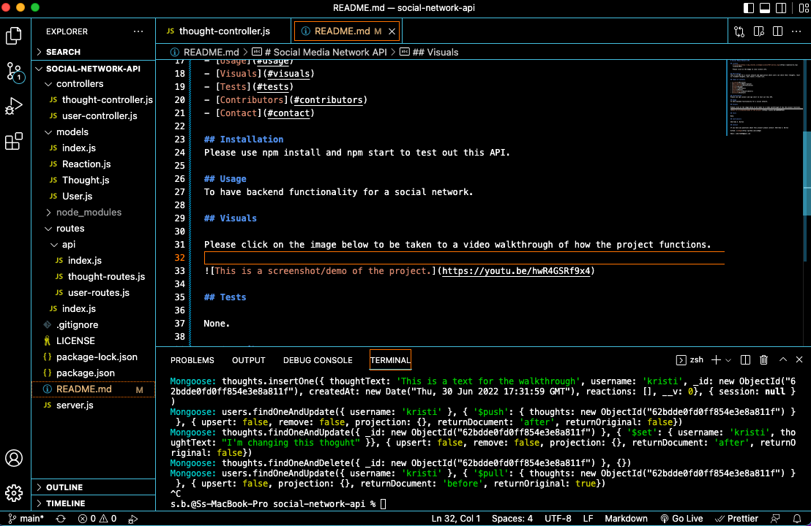

# Social Media Network API 

## License
   

   Please click on the badge to view license info.
   

## Description
This is an API for a social network web application where users can share their thoughts, react to friends’ thoughts, and create a friend list.

## Table of Contents

- [License](#license)
- [Description](#description)
- [Installation](#installation)
- [Usage](#usage)
- [Visuals](#visuals)
- [Tests](#tests)
- [Contributors](#contributors)
- [Contact](#contact)

## Installation
Please use npm install and npm start to test out this API.

## Usage
To have backend functionality for a social network.

## Visuals

Please click on the image below to be taken to a video walkthrough of how the project functions.

## Tests

None.

## Contributors

Sherreka S. Burton

## Contact

If you have any questions about this project please contact: Sherreka S. Burton

Github: [ssbbgm](http://github.com/ssbbgm)

Email: ssburto825@gmail.com

